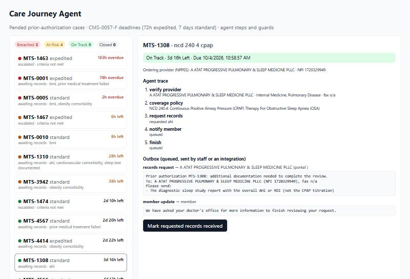

# Care Journey Agent

Task-driven agents that close documentation gaps on **pended prior-authorization cases** before the **CMS-0057-F**
decision deadline (72 hours expedited, 7 calendar days standard). The agent verifies the ordering provider in the
**live NPPES NPI Registry**, reads the **live CMS coverage policy**, requests exactly the missing records, keeps the member
informed, and escalates to a clinician only when policy requires it. Every step is logged; unsafe steps are blocked.



## Real inputs
- **Cases:** the 16 real MTSamples cases that [PriorAuth Copilot](https://github.com/achi-vyshnavi28/priorauth-copilot)
  pended, with its pend reason and the facts the documentation did not state ([`data/pended_cases.json`](data/pended_cases.json)).
- **Tools:** the public [NPPES NPI Registry API](https://npiregistry.cms.hhs.gov/api-page) and the
  [CMS Coverage API](https://api.coverage.cms.gov/docs/swagger/index.html), called live; tests replay recorded real responses.
- **Deadlines:** the [CMS Interoperability and Prior Authorization Final Rule (CMS-0057-F)](https://www.cms.gov/newsroom/fact-sheets/cms-interoperability-prior-authorization-final-rule-cms-0057-f).
- MTSamples notes carry no provider, so each case is paired with a real NPPES organisation of the matching specialty,
  and demo arrival times are spread so the board shows every SLA state. Both are marked as demo values in the data.

## How it works

```
pended case ─> task loop (max 12 steps)
                 planner: LLM (function calling) or rules playbook ─> guard ─> tool ─> task log (DynamoDB)
                 obligations (computed, not chosen): verify provider · check policy · escalate if required ·
                                                     request each missing fact · notify member · finish
tools: verify_provider (NPPES, live) · coverage_policy (CMS, live) · request_records · notify_member ·
       escalate_to_clinician ─> outbox (SQL, unique idempotency key; staff or an integration sends it)
follow-ups: DynamoDB GSI  FOLLOWUP#open / due_at  -> the scheduler's "what is due next" query
```

**Guards the planner cannot bypass:** only listed tools; no records request before the provider is verified, and only
for facts that are actually missing; no repeated steps; no escalation unless required (clinician time is the scarce
resource: SLA at risk or breached, criteria not met, or an unknown provider); no finish while obligations remain; an
identical outbound message is never queued twice.

## What building it taught me (evaluated on the 16 real journeys)
| Planner | Correct journeys | What went wrong |
|---|---|---|
| Rules playbook | **16/16** | - |
| LLM, first version | 11/16 | Rate-limit errors fell back to the playbook; escalated cases that only needed records |
| LLM + escalation guard | 6/16 | Looped on `notify_member`; escalated and finished without requesting records |
| LLM + obligations + repeat guard | see `results/agent_eval_llm.json` | |

An unconstrained LLM planner is unsafe even with good prompts. What worked was **plan-and-execute with obligations**:
code decides *what* must happen, the model decides *order and wording*, and guards block everything else.

| Layer | Technology |
|---|---|
| API | Python, FastAPI, pydantic, request-id structured logs |
| Agent | Task loop, OpenAI-compatible function calling (gpt-oss-120b on Groq), rules fallback, guards |
| NoSQL / AWS | **DynamoDB** single-table task log and follow-up index (boto3; moto locally and in tests) |
| Relational | SQLAlchemy Core on **PostgreSQL** and **MySQL** (SQLite locally): journeys and an idempotent outbox |
| Frontend | **React + TypeScript** (Vite): SLA board, agent trace with blocked steps, outbox |
| Tests / CI | 18 pytest (also run on PostgreSQL and MySQL), 4 Vitest; GitHub Actions with DB service containers, an agent gate on the real cases, frontend build, Docker smoke test |

## Run
```bash
pip install -r requirements.txt
python -m pytest                         # 18 tests (set JOURNEY_TEST_PG_URL / JOURNEY_TEST_MYSQL_URL for real DBs)
python -m evals.run_agent_eval           # rules and LLM planners on the 16 real cases (live APIs; LLM needs GROQ_API_KEY)
python scripts/demo_api.py               # API on :8930, journeys for the real cases
cd web && npm install && npm run dev     # dashboard on :5176
```

## Limits
- Outbound messages are queued, not sent; a real deployment adds a fax or portal integration and a human check.
- Provider pairings and arrival times are demo values; 16 journeys is a small evaluation.
- The playbook encodes one team's policy; real utilization-management rules vary by payer and service.
